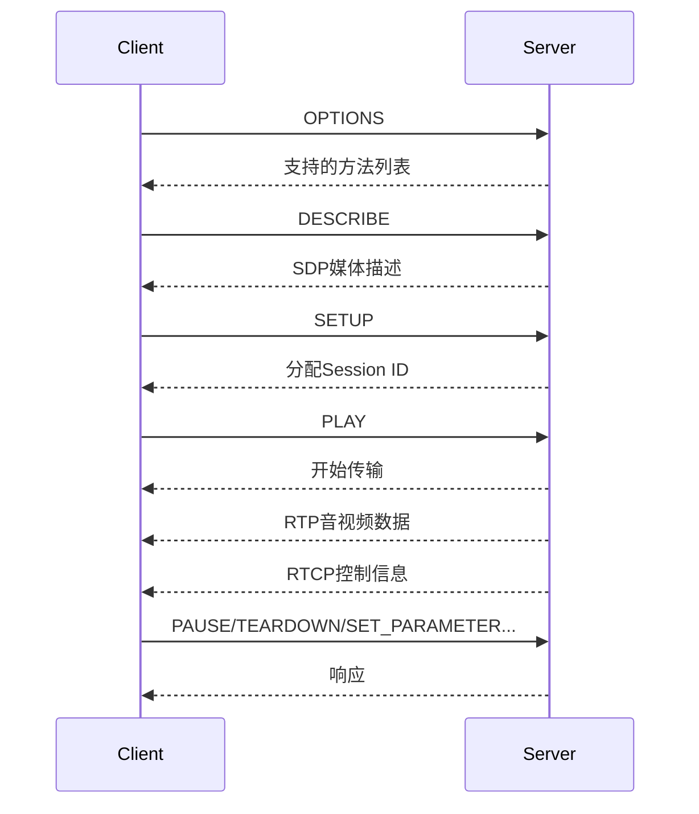

# RTSP协议简介与应用场景

> 参考：[RTSP协议探秘：从原理到C++实践，解锁实时流媒体传输之道-阿里云开发者社区](https://developer.aliyun.com/article/1463836)

---

## 1. 什么是RTSP协议？

**RTSP（Real-Time Streaming Protocol，实时流媒体传输协议）** 是一种应用层协议，专为实时流媒体数据传输而设计。它主要用于客户端与服务器之间的媒体流控制，包括建立连接、控制播放状态（如播放、暂停、停止）、调整参数（如带宽、码率）等。

---

## 2. RTSP协议的应用场景

- **视频监控系统**：实现实时监控画面的远程传输和播放。
- **在线教育**：支持在线课堂的实时音视频互动。
- **远程会议**：实现多方实时音视频共享，提高会议效率。
- **直播娱乐**：为直播平台提供低延迟音视频传输能力。

---

## 3. RTSP协议的组成

RTSP协议主要由以下几个部分组成：

1. **请求与响应机制**  
   类似HTTP，采用请求-响应模式。客户端发送请求命令（如PLAY、PAUSE），服务器返回响应消息。

2. **方法（Methods）**  
   RTSP定义了一系列方法，用于描述客户端与服务器的交互操作。常见方法包括：
   - `OPTIONS`：查询服务器支持的RTSP方法
   - `DESCRIBE`：获取媒体资源描述（如SDP信息）
   - `SETUP`：建立媒体流传输会话
   - `PLAY`：开始播放媒体流
   - `PAUSE`：暂停播放
   - `TEARDOWN`：终止会话
   - `SET_PARAMETER` / `GET_PARAMETER`：设置/获取参数

3. **状态码**  
   三位数字，类似HTTP。例如：
   - `200`：请求成功
   - `404`：资源未找到
   - `500`：服务器内部错误

4. **会话标识（Session ID）**  
   用于标识特定的媒体流传输会话。由服务器在SETUP请求后分配，后续请求需携带该ID。

5. **传输层协议**  
   RTSP通常与RTP（Real-time Transport Protocol）和RTCP（Real-time Transport Control Protocol）配合使用：
   - **RTP**：负责音视频数据的实时传输
   - **RTCP**：负责传输控制信息，如同步、丢包统计、带宽反馈等

---

## 4. RTSP协议的工作原理

> **RTSP本身不传输媒体数据，而是作为控制通道，指挥和协调RTP/RTCP协议完成音视频数据的实时传输。**

### 4.1 流程简述

1. **OPTIONS**  
   客户端向服务器发送OPTIONS请求，查询服务器支持的RTSP方法。

2. **DESCRIBE**  
   客户端发送DESCRIBE请求，获取媒体资源的描述信息（如SDP，包含编码格式、码率、分辨率等）。

3. **SETUP**  
   客户端根据描述信息发送SETUP请求，建立媒体流传输会话。服务器分配Session ID并返回。

4. **PLAY/PAUSE**  
   客户端使用Session ID发送PLAY、PAUSE等请求，控制媒体流的播放状态。

5. **TEARDOWN**  
   客户端发送TEARDOWN请求，终止媒体流传输会话。

6. **RTP/RTCP传输**  
   - 服务器通过RTP协议将音视频数据分包发送给客户端。
   - 客户端收到RTP包后进行解码和播放。
   - 客户端和服务器通过RTCP协议交换控制信息，实现同步、丢包统计、网络自适应等。

7. **参数调整与反馈**  
   - 客户端和服务器可通过SET_PARAMETER、GET_PARAMETER等方法调整媒体流参数（如码率、分辨率）。
   - 网络异常（如拥塞、丢包）时，RTCP提供反馈，双方可动态调整传输策略。

### 4.2 工作原理流程图



---

## 5. RTSP与RTP/RTCP的关系

- **RTSP**：负责会话管理和控制（如播放、暂停、参数调整），本身不传输媒体数据。
- **RTP**：负责音视频数据的实时传输，支持分包、时间戳、序列号等机制，保证数据有序和同步。
- **RTCP**：负责传输控制信息，如统计丢包、同步音视频、带宽反馈等，辅助RTP实现高质量传输。

> **RTSP协议通常通过RTP发送音视频原始数据流。数据可能被封装在如MP4、MKV等容器格式中，容器内的音视频流采用特定编码（如H.264、AAC）。客户端需先解封装，才能播放。**

---

## 6. RTSP常用请求示例

```http
OPTIONS rtsp://example.com/media.mp4 RTSP/1.0
CSeq: 1

DESCRIBE rtsp://example.com/media.mp4 RTSP/1.0
CSeq: 2
Accept: application/sdp

SETUP rtsp://example.com/media.mp4/trackID=1 RTSP/1.0
CSeq: 3
Transport: RTP/AVP;unicast;client_port=8000-8001

PLAY rtsp://example.com/media.mp4 RTSP/1.0
CSeq: 4
Session: 12345678
```

---

## 7. RTSP协议的优缺点

### 优点

- 支持实时控制（播放、暂停、快进、快退等）
- 支持多种媒体类型和编码格式
- 低延迟，适合实时场景
- 可扩展性强，支持参数动态调整

### 缺点

- 需专门客户端支持，浏览器原生不支持
- 对网络环境要求较高，易受丢包、延迟影响
- 防火墙穿透性较差（多端口、多协议）

---

RTSP协议是流媒体领域的重要协议，广泛应用于安防监控、直播、远程教育等场景。它通过与RTP/RTCP的协作，实现了高效、低延迟的音视频实时传输和灵活的流控制。理解RTSP的原理和流程，有助于开发和调试流媒体相关应用。

---

