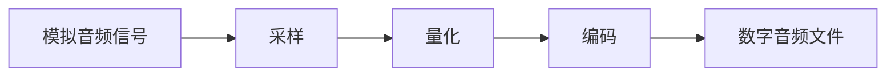
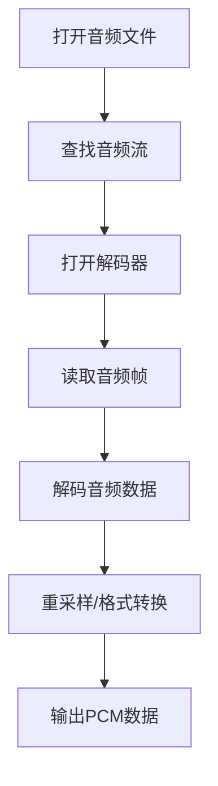

# 音频原理笔记

---

## 1. 音频基本概念

### 1.1 模拟与数字音频

- **模拟信号**：音频信号在自然界中以模拟形式存在，表现为随时间连续变化的声波（如空气中的压力波）。
- **数字音频**：通过采样和量化，将模拟信号转化为离散的数字信号，便于计算机存储和处理。

### 1.2 音频采样的基本参数

| 参数         | 说明                                                         | 常见值           |
| ------------ | ------------------------------------------------------------ | ---------------- |
| 采样率       | 每秒采样次数，单位Hz，决定可还原的最高频率（奈奎斯特定理）   | 44.1kHz, 48kHz   |
| 量化位深     | 每个采样点的二进制位数，决定动态范围和精度                   | 8, 16, 24, 32位  |
| 声道数       | 单声道（Mono）、立体声（Stereo）等                           | 1, 2             |
| 编码格式     | PCM、MP3、AAC、FLAC等                                        |                  |

#### 采样与量化流程图



#### 采样与量化举例

1. **原始模拟信号**：连续变化的电压信号，代表音频波形。
2. **采样**：在固定时间间隔内（如每1/44100秒）取样该信号的电压值。
3. **量化**：将电压值转换为数字格式（如16位量化，范围0~65535）。
4. **编码输出**：生成数字音频文件（如WAV、MP3），可在数字设备播放。

---

## 2. SDL播放PCM音频

### 2.1 PCM简介

- **PCM（Pulse Code Modulation）**：脉冲编码调制，是最常见的无损数字音频格式，数据未压缩，常用于音频处理和传输。

### 2.2 SDL播放PCM音频示例

```cpp
// filepath: e:\obnote\ffmpeg\音频原理.md
void AudioCallback(void* userdata, Uint8* stream, int len) {
    std::cout << "AudioCallback" << std::endl;
    SDL_memset(stream, 0, len);
    auto ifs = (std::ifstream*)userdata;
    ifs->read((char*)stream, len);
    if (ifs->gcount() <= 0) {
        SDL_PauseAudio(1);
    }
}

int main(int argc, char* argv[]) {
    // 初始化音频SDL模块
    SDL_Init(SDL_INIT_AUDIO);

    // 配置音频参数
    SDL_AudioSpec spec;
    spec.freq = 44100;                // 采样率
    spec.format = AUDIO_S16SYS;       // 采样格式（16位有符号）
    spec.channels = 2;                // 声道数（立体声）
    spec.silence = 0;                 // 静音值
    spec.samples = 1024;              // 缓冲区样本数
    spec.callback = AudioCallback;    // 回调函数
    std::ifstream ifs("test_pcm.pcm", std::ios::binary);
    if (!ifs) {
        std::cerr << "open pcm file failed!" << std::endl;
        return -1;
    }
    spec.userdata = &ifs;

    if (SDL_OpenAudio(&spec, nullptr) < 0) {
        std::cerr << "SDL_OpenAudio failed: " << SDL_GetError() << std::endl;
        return -1;
    }
    SDL_PauseAudio(0);

    ::getchar();
    ifs.close();
    SDL_QuitSubSystem(SDL_INIT_AUDIO);
    return 0;
}
```

#### 关键结构体 SDL_AudioSpec

| 字段         | 说明                       |
| ------------ | -------------------------- |
| freq         | 采样率（Hz）               |
| format       | 音频格式（如16位有符号）   |
| channels     | 声道数                     |
| silence      | 静音值                     |
| samples      | 缓冲区样本数               |
| callback     | 回调函数                   |
| userdata     | 用户自定义数据指针         |

#### SDL_OpenAudio说明

- `int SDL_OpenAudio(SDL_AudioSpec *desired, SDL_AudioSpec *obtained);`
    - `desired`：期望的音频参数
    - `obtained`：实际获得的音频参数（可为nullptr）
- 推荐使用`SDL_OpenAudioDevice`，支持多设备和更灵活的配置。

#### callback说明

- `void AudioCallback(void* userdata, Uint8* stream, int len)`
    - `stream`：SDL提供的音频缓冲区，需填充音频数据
    - `len`：缓冲区字节数
    - `userdata`：用户自定义数据（如文件流指针）

---

## 3. FFmpeg音频处理接口

### 3.1 基本流程

- **封装与解码**：与视频处理类似，音频流的读取、解码、重采样等均可通过FFmpeg相关API实现。
- **常用API**：
    - `avformat_open_input`：打开音频文件
    - `avformat_find_stream_info`：获取流信息
    - `avcodec_find_decoder`：查找解码器
    - `avcodec_open2`：打开解码器
    - `av_read_frame`：读取音频帧
    - `avcodec_send_packet` / `avcodec_receive_frame`：解码音频数据
    - `swr_convert`：重采样（如采样率、声道数转换）

### 3.2 典型音频解码流程图



---

## 4. 常见问题与注意事项

- **采样率与音质**：采样率越高，可还原的频率范围越广，但文件体积也越大。
- **位深与动态范围**：位深越高，动态范围越大，失真越小。
- **缓冲区大小**：缓冲区过小可能导致音频卡顿，过大则延迟增加。
- **SDL回调机制**：音频数据需及时填充，避免播放中断。

---

## 5. 参考资料

- [SDL官方文档](https://wiki.libsdl.org/)
- [FFmpeg官方文档](https://ffmpeg.org/documentation.html)
- [音频数字信号处理基础](https://zh.wikipedia.org/wiki/%E9%9F%B3%E9%A2%91%E4%BF%A1%E5%8F%B7%E5%A4%84%E7%90%86)

---
